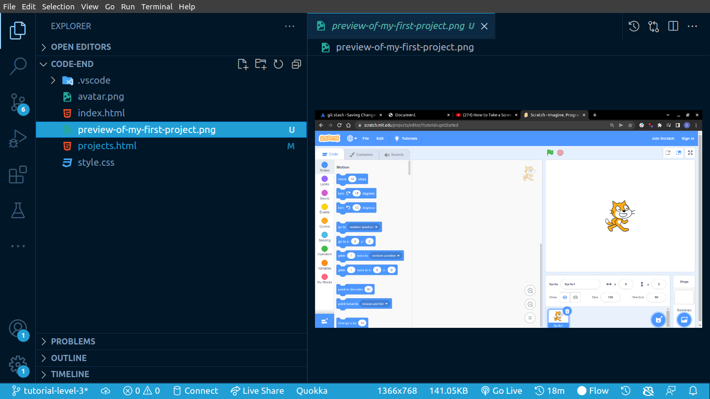
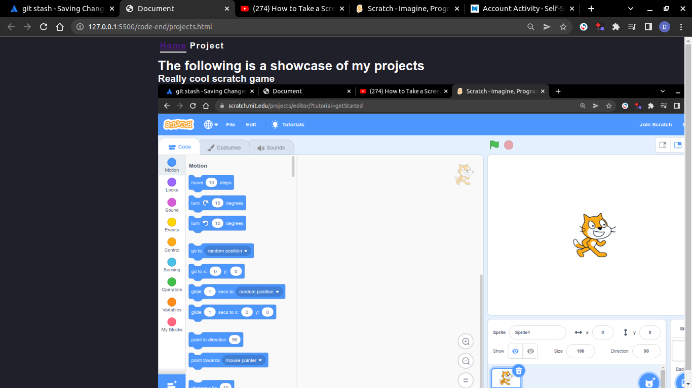
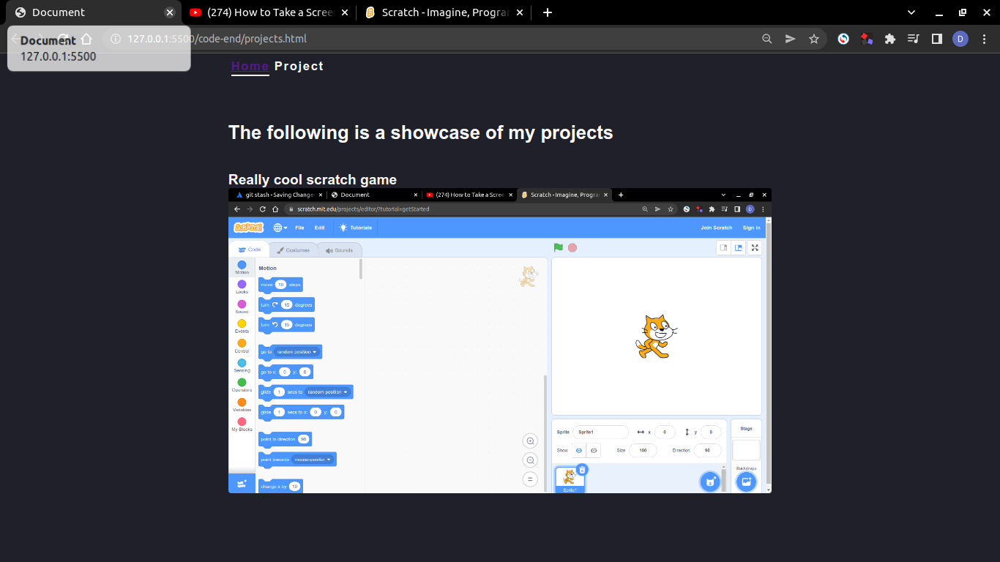

# Tutorial level 3

Hello, this is the Third lesson of the tutorial to transform your single webpage into a complete website.

## What we will be doing

In the last lesson, we learned how to connect `index.html` and `projects.html` and go back and forth between the two. Our `projects.html` is completely blank for now.

Let's add some project to our `project.html`.

## Steps

Follow the steps to complete this level of the tutorial.

### Step 1

Let's create a `<main>` tag that will contain most of our code. Locate the closing `</nav>` tag inside your `projects.html`. Add a `<main>` element after the closing `</nav>` tag. Give it a class of "global-container".

Your `projects.html` should now be similar to this :

```html
<!DOCTYPE html>
<html lang="en">
<head>
    <meta charset="UTF-8">
    <link rel="stylesheet" href="./style.css"></link>
    <meta http-equiv="X-UA-Compatible" content="IE=edge">
    <meta name="viewport" content="width=device-width, initial-scale=1.0">
    <title>Document</title>
</head>
<body>
    <nav class="global-container header">
        <a class="current" href="./index.html">Home</a>
        <a class="">Project</a>
    </nav>
    <main class="global-container" ></main> <!-- New piece of code-->
</body>
</html>
```

We use the `<main>` tag to tell the browser that its content is the main focus of the document.

### Step 2

Inside the `<main>` tag, create add a `<h1>` with text telling us what the page is about. Then create a `<h2>` with the name of the first project you want to showcase. The code inside your body element should now be similar to the following.

```html
<!-- Some code -->
<body>
    <nav class="global-container header">
        <a class="current" href="./index.html">Home</a>
        <a class="">Project</a>
    </nav>
    <main class="global-container" >
        <h1>The following is a showcase of my projects</h1>

        <h2>Really cool scratch game</h2>
    </main> <!-- New piece of code-->
</body>
<!-- Some more code -->
```

### Step 3

Let's now add an image to showcase our project - Show don't tell : ).  
To do so, save a  of your project into the root of the project ( directory/folder with the `index.html` ). Your root directory should now look similar to the following:  



### Step 4

Let's add our new image to our `projects.html`. To do so, we add an image tag `` after the last `<h2>`, then set it's `src` attribute to name of our image.

The code inside `projects.html` should now look similar to the following.  

```html
<!-- Some code -->
<body>
    <nav class="global-container header">
        <a class="current" href="./index.html">Home</a>
        <a class="">Project</a>
    </nav>
    <main class="global-container" >
        <h1>The following is a showcase of my projects</h1>

        <h2>Really cool scratch game</h2>
        
         
    </main> <!-- New piece of code-->
</body>
<!-- Some more code -->
```

Your live preview should now show something similar to the following.  



### Step 5

Let's make our page look a lot prettier with some css. Copy and paste the following code inside your `projects.html`.

```css
img {
    /* The biggest an image can ever be is 100%. That is that the image can never bigger than its container */
    max-width: 100%;
}

h1, h2 {
    margin-top: 2em;
}
```

Your web browser should now show something similar to the following :  



<p align="center"> 彡(ノ^ ^)ノ Congratulations ヘ(^ ^ヘ)☆彡.</p>
