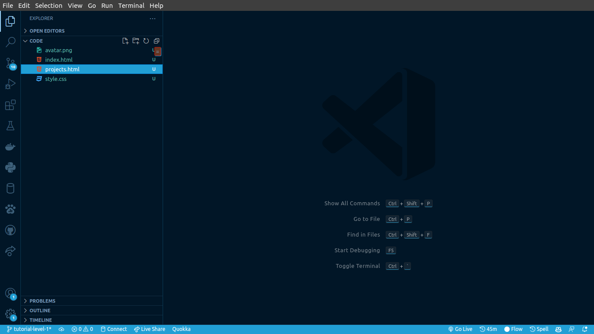
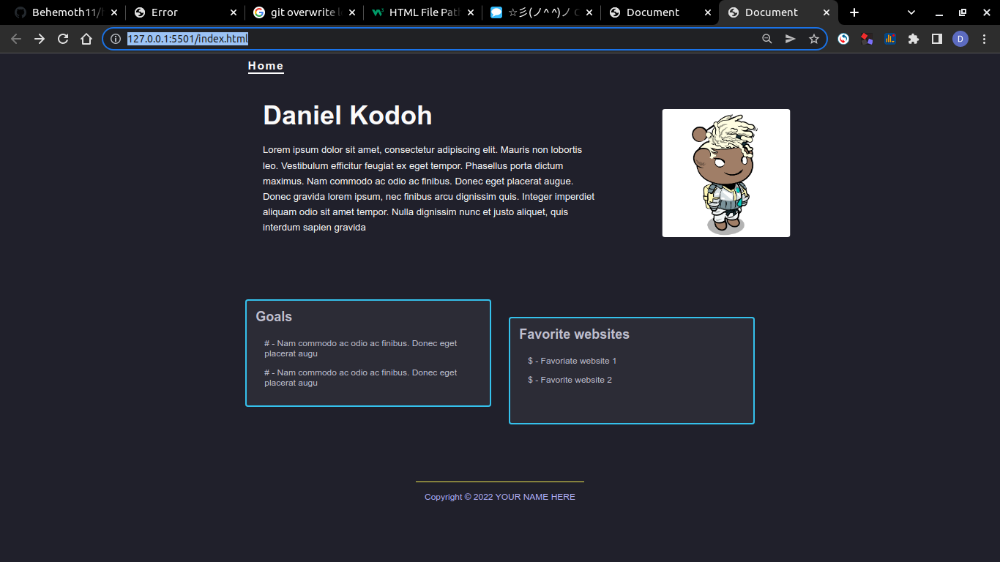
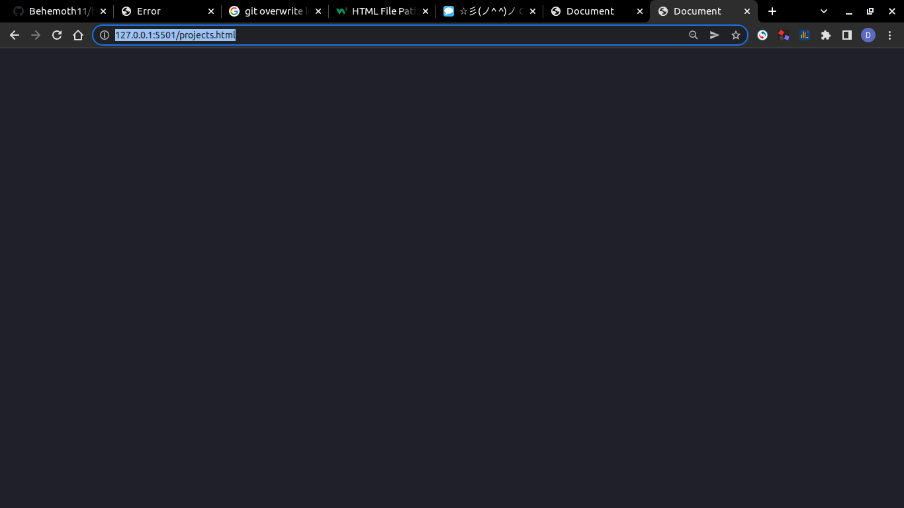

# Tutorial level 1

Hello, this is the first lesson of the tutorial to transform your single webpage into a complete website.

## What we will be doing

The goal of this step of the tutorial is to create a new webpage that will contain our projects.

## Steps

Follow the following steps to complete this level of the tutorial.

### Step 1

Create a file in the `root` folder ( the folder that contains the index.html ) called `projects.html`. The folder structure in vscode should be similar to the following



### Step 2

Next, initialize your `projects.html` with some code. Add the following to your `projects.html` file.

```html
<!DOCTYPE html>
<html lang="en">
<head>
    <meta charset="UTF-8">
    <meta http-equiv="X-UA-Compatible" content="IE=edge">
    <meta name="viewport" content="width=device-width, initial-scale=1.0">
    <title>Document</title>
</head>
<body>
    
</body>
</html>
```

> Tip 1 : Type the `!` and select from the dropdown to have the code automatically generated for you.
>
> Tip 2: Just copy and paste the code from above. If you are not sure how to copy and paste check out this [video](https://youtu.be/W0-J14EjrMA).

### Step 3

Finally, we have to link our style sheet from `style.css` to our html in `projects.html`; To do so, add the following code inside the document head  ( the part of the document between the `<head>` tags).

```html
<link rel="stylesheet" href="./style.css"></link>
```

Your `projects.html` should now look like this:

```html
<!DOCTYPE html>
<html lang="en">
<head>
    <meta charset="UTF-8">
    <link rel="stylesheet" href="./style.css"></link> <!-- new piece of code -->
    <meta http-equiv="X-UA-Compatible" content="IE=edge">
    <meta name="viewport" content="width=device-width, initial-scale=1 0">
    <title>Document</title>
</head>
<body>
    
</body>
</html>
```

The added style tag tells the html to use the css code written in `style.css` to render the page.

> Notice that we wrote the path as `./style.css`. The `./` tells the html to look for `style.css` in the same directory. click [here](https://www.w3schools.com/html/html_filepaths.asp) to learn more about html paths.

You can now start live servers and replace `index.html` in the url by `projects.html` you should see an empty html page.

Old url:


New url:


<div style="text-align: center; font-size: 2em; "> 彡(ノ^ ^)ノ Congratulations ヘ(^ ^ヘ)☆彡.</div>
