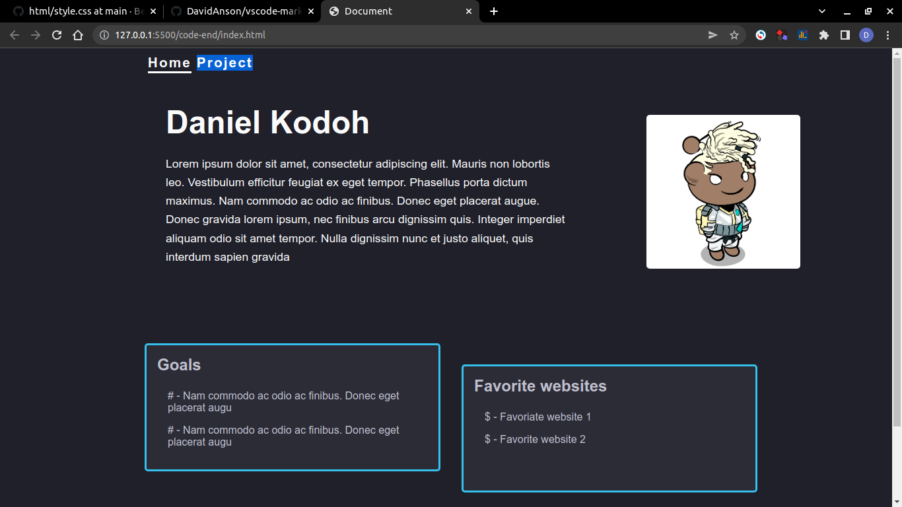
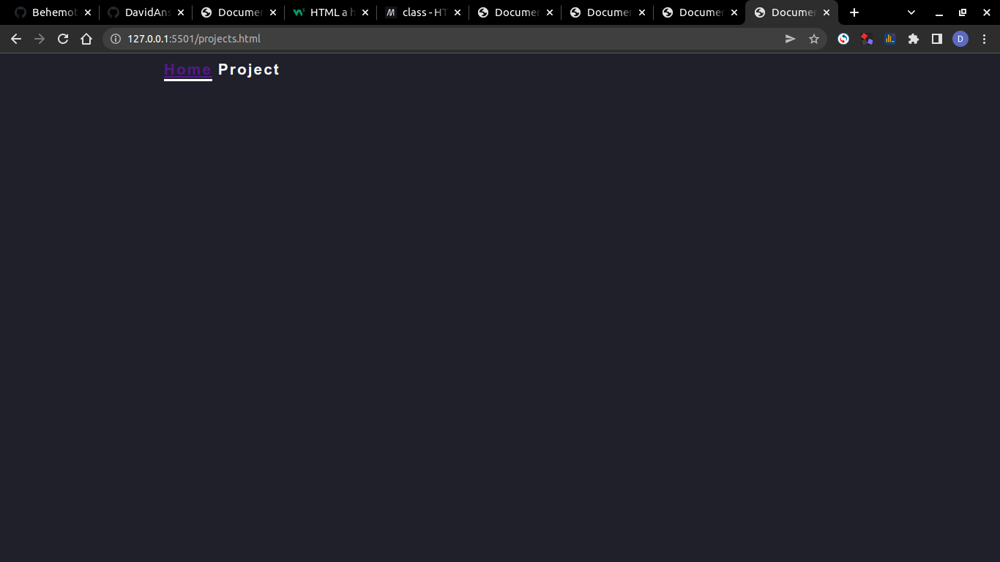

# Tutorial level 2

Hello, this is the second lesson of the tutorial to transform your single webpage into a complete website.

## What we will be doing

In the last page lesson we created a new web page. While we could navigate between the two pages by changing the url. Its would be more convenient to be able to navigate using button.

In this tutorial, we learn how to connect our two pages `index.html` and `projects.html` and go back and fourth between the two.

## Steps

Follow the following steps to complete this level of the tutorial.

### Step 1

Let's first connect the main page in `index.html` to the project page in `projects.html`. Do do so locate the navigation bar in `<nav>`. Its the first tag under body. Add the following code inside the tag:

```html
<!-- some code -->
<nav class="global-container header">
  <a class="current">Home</a>
  <a class="">Project</a>
</nav>
<!-- rest of the code -->
```

Make sure to save your code. You should now see a link to project in the nav close to home. You web page should look similar to this.



### Step 2

You may have noticed that clicking on the project link does nothing. What makes anchor tags `<a>` is the [href](https://www.w3schools.com/tags/att_a_href.asp) [attribute](https://www.w3schools.com/html/html_attributes.asp).  
Let's add a href attribute to the new link so that it goes to the `projects.html` after its clicked.

Locate the project anchor tag inside your html. Add an href attribute with value `./projects.html`.

```html
<!-- some code -->
<nav class="global-container header">
  <a class="current">Home</a>
  <a class="" href="./projects.html">Project</a>
</nav>
<!-- some more code -->
```

> Note the `./` before `projects.html`. Make sure to add it as well, if you want your web page to work once uploaded to github.

Clicking on the project link should now direct you to your projects.html page. If not make sure that the filename `projects.html`, the href attribute and the href value `./projects.html` where typed in properly.

### Step 3

In this step we will link the `projects.html` page to the `index.html` page.  
Let's first copy the `index.html` navigation code ( the code inside the `<nav>` tag ) to `projects.html`.

Your `projects.html` should now look like the following.

```html
<!DOCTYPE html>
<html lang="en">
<head>
    <meta charset="UTF-8">
    <link rel="stylesheet" href="./style.css"></link>
    <meta http-equiv="X-UA-Compatible" content="IE=edge">
    <meta name="viewport" content="width=device-width, initial-scale=1.0">
    <title>Document</title>
</head>
<body>
    <nav class="global-container header">
        <a class="current">Home</a>
        <a class="" href="./projects.html" >Project</a>
    </nav>

</body>
</html>
```

Take some time to think of how to make your browser navigate to `index.html` when home is clicked.
Waiting ..., waiting ..., Time almost done

Let's make some changes so that the Home anchor tag ( link ) directs to the home files.
Add a href attribute to the Home anchor tag so it links to `./index.html`.

your code should now look similar to this :

```html
<!DOCTYPE html>
<html lang="en">
<head>
    <meta charset="UTF-8">
    <link rel="stylesheet" href="./style.css"></link>
    <meta http-equiv="X-UA-Compatible" content="IE=edge">
    <meta name="viewport" content="width=device-width, initial-scale=1.0">
    <title>Document</title>
</head>
<body>
    <nav class="global-container header">
        <!-- node the new href inside the following a tag -->
        <a class="current" href="./index.html" >Home</a>
        <a class="" href="./projects.html" >Project</a>
    </nav>

</body>
</html>
```

> Note the `./` before `index.html`. Make sure to add it as well, if you want your web page to work once uploaded to github.

You should now be able to navigate back and forth between `index.html` and `projects.html`.

### Step 4 ( Bonus )

You may have noticed that the href to `./projects.html` inside the `projects.html` file does nothing since we are already on the `projects.html` page when we click on the link.

Go ahead and remove the href attribute from the project link **only** inside the **`projects.html`** file.

Your `projects.html` file should now look like the following: 

```html
<!DOCTYPE html>
<html lang="en">
<head>
    <meta charset="UTF-8">
    <link rel="stylesheet" href="./style.css"></link>
    <meta http-equiv="X-UA-Compatible" content="IE=edge">
    <meta name="viewport" content="width=device-width, initial-scale=1.0">
    <title>Document</title>
</head>
<body>
    <nav class="global-container header">
        <!-- node the new href inside the following a tag -->
        <a class="current" href="./index.html" >Home</a>
        <a class="" >Project</a>
    </nav>

</body>
</html>
```

The main page `index.html` page should look similar to this:  


The project page `project.html` page should look similar to this:  



<p align="center"> 彡(ノ^ ^)ノ Congratulations ヘ(^ ^ヘ)☆彡.</p>
